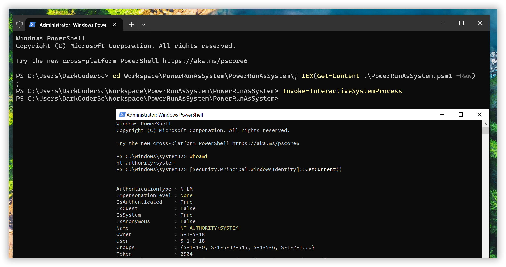
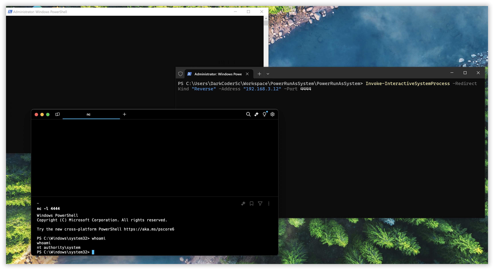
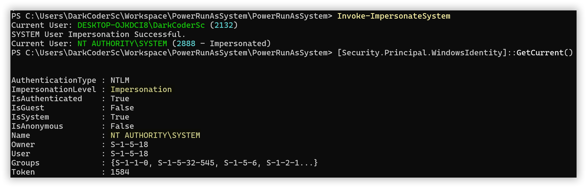
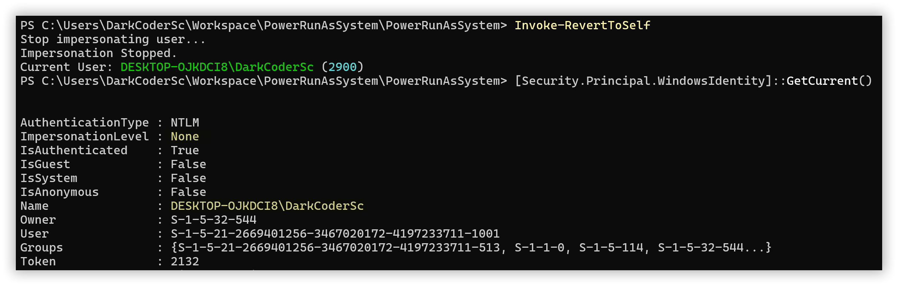

**PowerRunAsSystem** is a PowerShell script, also available as an installable module through the PowerShell Gallery, designed to impersonate the **NT AUTHORITY/SYSTEM** user and execute commands or launch interactive processes without relying on third-party tools. It achieves this using only native Windows build-in features.

Traditionally, elevating privileges to the SYSTEM user from an administrator account requires using tools like [PsExec from Sysinternals](https://learn.microsoft.com/en-us/sysinternals/downloads/psexec) or creating a custom service. With PowerRunAsSystem, you can accomplish the same goal using the built-in Windows Task Scheduler, eliminating the need for external utilities.

This tool allows you to:

* Impersonate the SYSTEM user in the current terminal session
* Run non-interactive commands as SYSTEM
* Launch a new interactive process as SYSTEM (tied to the active terminal session)

In cases where graphical access to the machine is unavailable, you can redirect the input/output of the spawned SYSTEM process to a listener (e.g., a Netcat listener) for interaction.

> It’s important to note that administrative privileges are required to spawn a SYSTEM process in a standard configuration. Ensure that you either access a remote terminal (e.g., SSH or WinRM) with administrative rights or open a new terminal with elevated privileges (Run as Administrator).

## Exported Functions

* `Invoke-SystemCommand`
* `Invoke-InteractiveSystemProcess`
* `Invoke-ImpersonateSystem`
* `Invoke-RevertToSelf`

## Installation

### PowerShell Gallery (Recommended)

The following commands for the installation process may require privileges (e.g., Administrative rights, appropriate Execution Policy settings). Ensure that you understand and meet these requirements before proceeding.

```powershell
Install-Module -Name PowerRunAsSystem
Import-Module -Name PowerRunAsSystem
```

### Importing as a Script

```powershell
IEX(Get-Content .\PowerRunAsSystem.ps1 -Raw -Encoding UTF8)
```

## Usage

### `Invoke-SystemCommand`

Spawn a new process as the SYSTEM user via Task Scheduler. Note that the SYSTEM process will not be tied to the active terminal session, meaning it won’t be interactive. This is useful for quickly running commands as SYSTEM without needing direct interaction with the process.

#### ⚙️ Available Arguments

| Parameter               | Type             | Default                                        | Description                |
|-------------------------|------------------|------------------------------------------------|----------------------------|
| Application             | String           | powershell.exe                                 | Program to execute         |
| Argument                | String           | -Command "whoami \| Out-File C:\result.txt"    | Optional program arguments |

### `Invoke-InteractiveSystemProcess`

Spawn a new interactive process as the SYSTEM user, which will be tied to the active terminal session and, if selected, visible on the current desktop.

This can be particularly useful in scenarios where an interactive SYSTEM process is needed. For instance, when using [Arcane Server](https://github.com/PhrozenIO/ArcaneServer), running it as an interactive SYSTEM process allows you to capture both the desktop and LogonUI/UAC prompts.



#### ⚙️ Available Arguments

| Parameter               | Type             | Default                                        | Description                      |
|-------------------------|------------------|------------------------------------------------|----------------------------------|
| CommandLine             | String           | powershell.exe                                 | The complete command line to execute. |
| Hide                    | Switch           | None                                           | If present, the process is not visible. |
| RedirectKind            | Choice           | None                                           | If the process input/output needs to be redirected to an external source (as discussed below)… |
| Address                 | String           | None                                           | Used if the **RedirectKind** is set (as described below). |
| Port                    | Int (R: 0-65535) | None                                           | Used if the **RedirectKind** is set (as described below). |

#### Advanced Usage : RedirectKind Flag

##### `None` (Default)

No specific redirection is used; the process is spawned normally. To interact with the process, you must do so through the desktop.

##### `Reverse`

The `stdout`, `stderr`, and `stdin` of the process are redirected to a network socket in reverse mode (client -> server). This setup enables interaction with the spawned process without requiring access to the desktop, which is particularly useful when the process is initiated from an SSH or WinRM session.

Example:

Create a new Netcat listener (adapt the command according to your operating system and version of Netcat):
````bash
nc -l 4444
````

Then, spawn your interactive SYSTEM process:

````powershell
Invoke-InteractiveSystemProcess -RedirectKind "Reverse" -Address "127.0.0.1" -Port 4444
````

Enjoy your SYSTEM shell 🐚



### `Invoke-ImpersonateSystem`

Impersonate the SYSTEM user within the current terminal session.



### `Invoke-RevertToSelf`

Stop user impersonation


